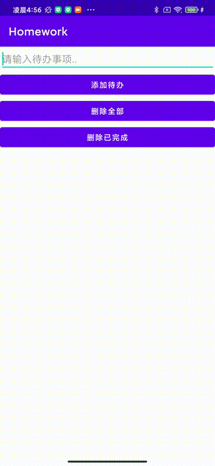

# readme

> 安卓学习笔记仓库:https://github.com/Abigail1985/Code-Learning-Note

## All-In-One

集中展示所有作业

**从Homework5开始, 仅更新在All-In-one中, 不再为单独为作业创建项目和文件夹**

## Homework7

**视频部分**

✅播放、暂停、重播功能； 

✅播放进度条展示（包括时间显示）、点击/滑动跳转到指定位置。

**图⽚部分**

✅⽹络图⽚展示(动图+静图)

✅⽀持左右滑动切换展示不同图⽚

## Homework6

✅基于database存储方式实现todolist 

✅基于recycleview实现查看任务列表界面

✅可删除任务

✅可多选操作

✅能区分已完成和未完成任务

✅界面丰富性——可一键删除所有任务

## Homework5 (正在更新..)

✅使用okHttp从api获取json数据

✅解析无嵌套的json数据input

❌使用wireshark / charles抓包分析

❌解析嵌套的json数据web_trans等

## Homework4

✅基于canvas和thread实现一个模拟时钟

✅模拟时钟上显示数字时间

✅模拟时钟下方实现一个同步的数字时钟

## Homework3

✅实现每个图标短按效果

✅实现长按点赞,抖动➕一键三连效果

## Homework2

> 参考《第一行代码》第三版

✅实现从 recycleview 中跳转到下一个 activity

✅实现把intent 传递的数据动态加载到 activity 布局中

✅参考`3.6.3启动Activity的最佳写法`采用了一种方便activity之间数据传递的写法

